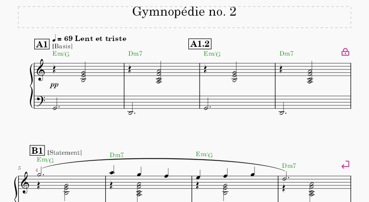
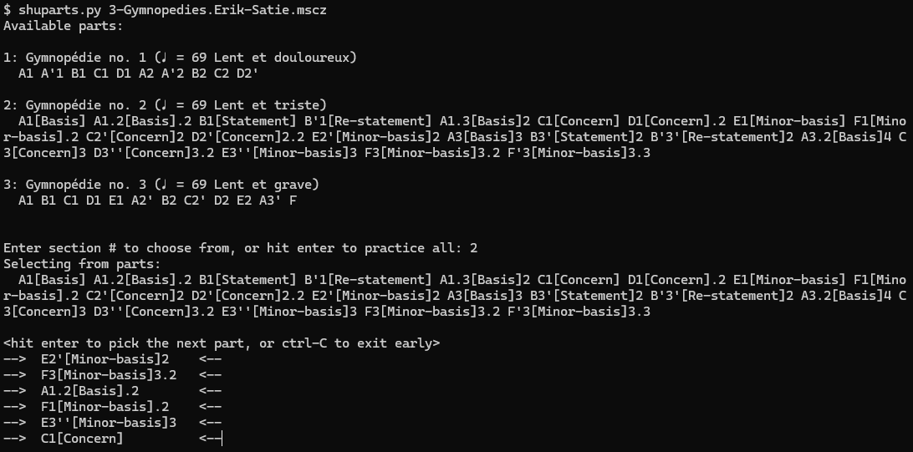

# shuparts
It's a flashcard tool for testing musical piece memorization at the command line.

Feed shuparts.py a list of part names, like

    shuparts.py A B C D

or give it a file from MuseScore Studio, like 

    shuparts.py 3-Gymnopedies.Erik-Satie.mscz

shuparts parses `mscz` files for rehearsal marks, tempo text, titles, and
section breaks.  If shuparts finds multiple sections, it'll ask the user to
type the number of the section to practice, or you can just hit enter to
practice parts across all the sections.

shuparts shuffles all the parts selected for practice and presents them one at
a time.  Hit enter to proceed to the next one.  Once the list is exhausted,
shuparts exits.

# Examples

MuseScore Studio music snippet from page 5 of 3-Gymnopedies.Erik-Satie.mscz

shuparts.py example execution

